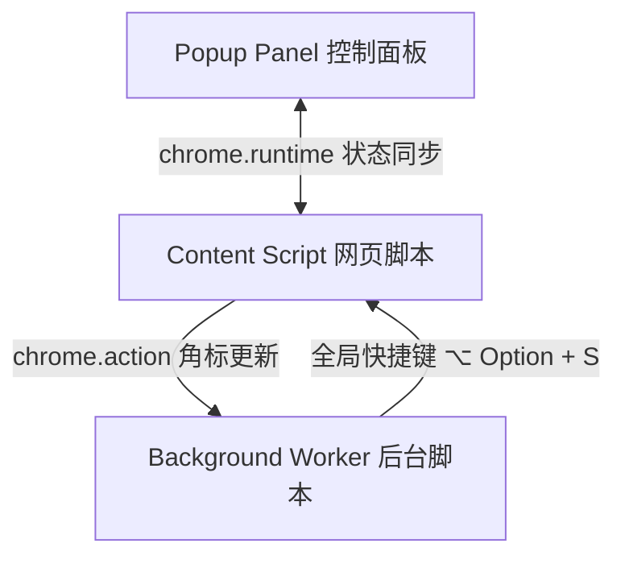

# 网页自动滚动助手 (Auto Scroll Pro) - 开发与技术日志 (Scratchpad)

本文档记录了自动滚动助手插件的核心技术选型、设计考量以及在开发过程中解决的关键工程问题。

---

## 🛠️ 架构设计

插件采用标准的 Chrome Extension Manifest V3 架构：



---

## 💡 核心技术攻关记录

### 1. 滚动速度精度不匹配与触底误判 (Bresenham 累加器算法)
* **发现问题**：
  在低滚动速度下（例如 30 px/s），屏幕刷新率 120Hz 导致单帧滚动步长仅为 $0.25$ 像素。直接调用 `window.scrollBy(0, 0.25)` 会被浏览器直接截断为 $0$，使页面无法滚动。在此状态下，原有的防卡顿判定在 30 帧内检测到位置无变化，会错误地判定为“已触底”并停止。
* **解决算法**：
  我们在 `content.js` 中引入了浮点累加器 `accumulatedScrollY`。只有当该累加器超过 `1` 像素时，才取出整数像素调用浏览器滚动，其余浮点误差暂存至下一帧。
  ```javascript
  const step = speed * elapsed;
  accumulatedScrollY += step;
  if (accumulatedScrollY >= 1) {
    const scrollPixels = Math.floor(accumulatedScrollY);
    window.scrollBy(0, scrollPixels);
    accumulatedScrollY -= scrollPixels;
  }
  ```
  该机制确保了即使在 1 px/s 的极端低速下，滚动的绝对速度也与设定速度完全吻合，且物理滚动能够被正常触发，从而消除了触底检测的误判。

### 2. 触底防卡死检测算法
* 为了防止页面底部检测因滚动精度、滚动容器边缘对齐产生误差，我们设计了双层检测：
  * **主检测**：`(currentScroll + clientHeight) >= (scrollHeight - 4)` 正常触发。
  * **副检测（防卡死检测）**：检测滚动坐标是否持续 1.5 秒没有改变，且在该时间段内“理论上应该位移”的距离超过 5 像素（以此避免超低速下对滚动周期的误杀）。

### 3. MV3 后台动态注入与权限配置
* **动态脚本注入**：
  在刚加载插件时，由于旧的网页选项卡尚未刷新，其内部不存在 `content.js`。我们通过在后台注册 `injectScript` 通道：
  ```javascript
  chrome.runtime.sendMessage({ action: 'injectScript', tabId: tabId })
  ```
  动态调用 `chrome.scripting.executeScript` 将滚动引擎热注入到当前页，从而保证用户无需刷新页面即可立即开始滚动。
* **Edge 专有协议拦截**：
  为了避免插件在 `edge://*`、`chrome://*` 等浏览器专有保留页面上运行引发越权报错，我们加入了健壮的协议过滤，仅允许在 `http://`、`https://` 和 `file://` 协议下激活面板状态。

---

## 🎨 UI/UX 视觉设计规范
* **风格**：毛玻璃暗黑极客风 (Glassmorphism Dark UI)。
* **面板宽度**：固定 `320px`，高度自适应控制在 `420px` 左右，以保证在所有主流操作系统和缩放比例下无任何垂直滚动条或遮挡。
* **核心配色**：
  * 主背景：`rgba(15, 12, 30, 0.85)` 与模糊度 `20px` 复合形成的毛玻璃层。
  * 主色调（渐变）：紫色 `rgb(108, 63, 255)` 到 靛青 `rgb(54, 0, 204)`。
  * 状态活动色：青色 `#00e5ff`（发光光晕过滤效果）。
